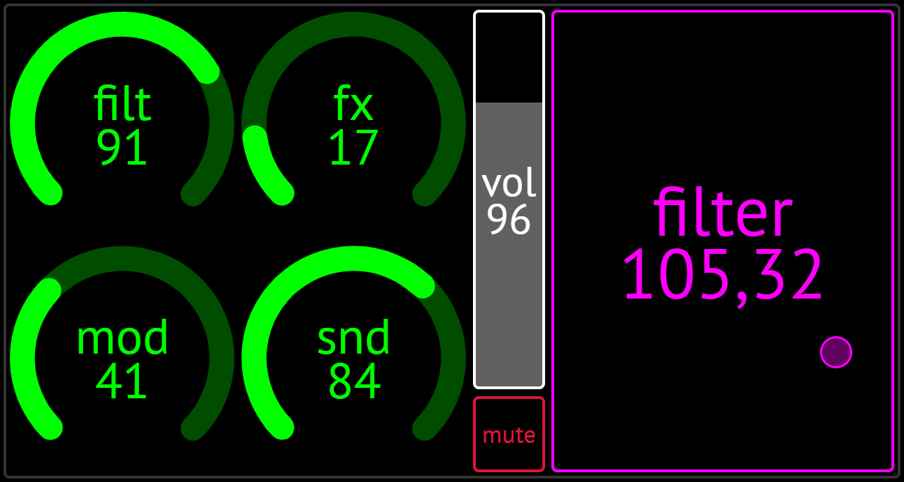
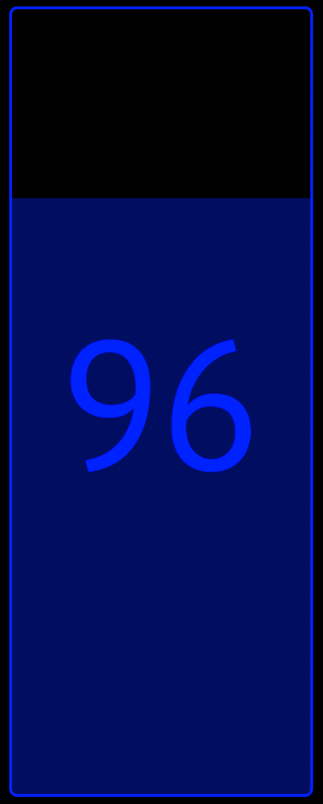
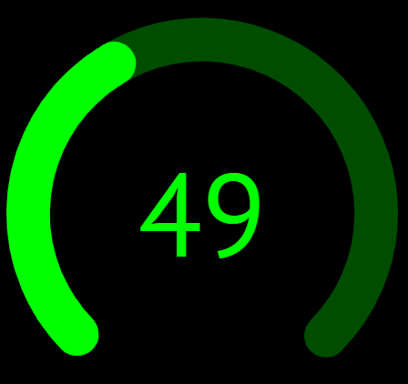
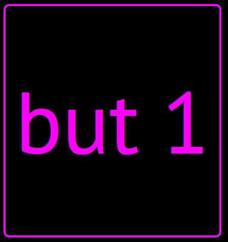
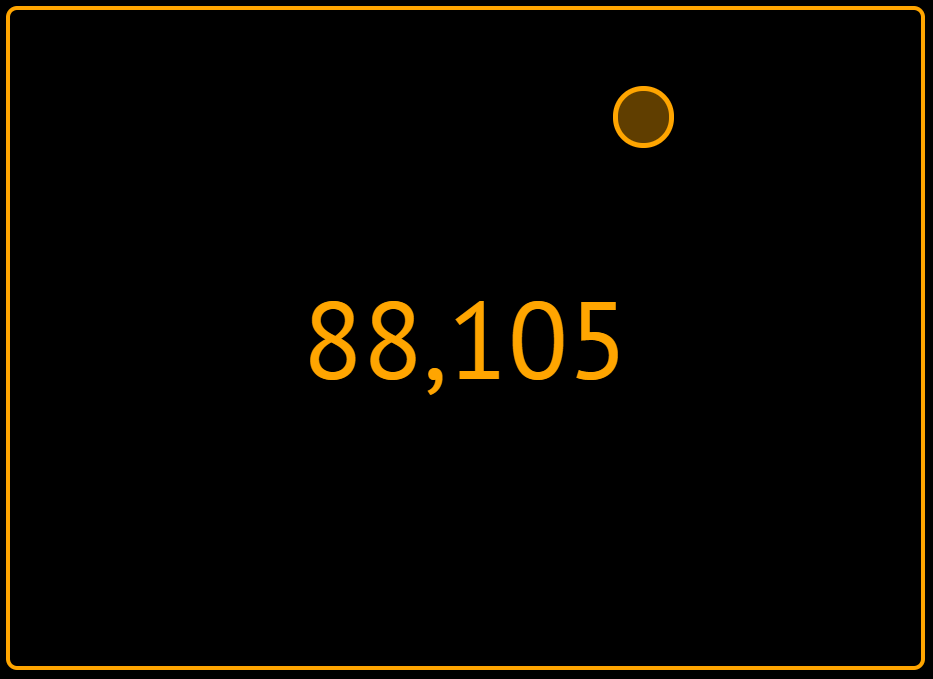

# Touch MIDI

'Touch MIDI' is a flexible MIDI control surface for touch based devices using HTML5.  
The project consists of a set of custom HTML elements which allows the user to build a simple HTML page which can act as a MIDI controller. The elements represent various physical controls such as sliders and buttons, and can be configured to send a range of MIDI messages.

Currently supported MIDI messages:

- CC (continuous controller).
- Notes on & off with velocity.
- NRPN (non-registered parameter number), including high resolution values

An example layout showing four encoders, a button, a slider and the XY pad

This is complete rewrite of an older [Touch MIDI project](https://github.com/benc-uk/touchmidi-old). It has been rewritten using web components ([using the excellent Hybrids.js as a library](https://hybrids.js.org/#/)), ES6 modules, WebPack and a much cleaner design.

Core technologies:

- [Web MIDI API](https://www.w3.org/TR/webmidi/)
- [Web Components & custom elements](https://developer.mozilla.org/en-US/docs/Web/Web_Components)
- Various modern web features: ES6 modules, inline SVG, ES6 DOM APIs, CSS3 tricks

Design goals:

- No backend or server required.
- Works 100% in browser (Only client side JS).
- Works with both mouse and touch screen devices.
- Supports multiple touches at the same time, and tracks movement of each.
- Layout HTML files can be opened and run from local `file://` URL.

# Supported Browsers

Although the Web MIDI API spec isn't new (it was drafted in 2015) support for it is currently [limited to Chrome, Edge and Opera](https://caniuse.com/?search=midi)

Mobile Chrome on an Android device has also been tested as working

# User Guide

Getting started, you'll need:

- A supported browser :)
- MIDI device attached to your machine, either directly via USB (e.g. a USB-MIDI based device) or via an audio interface or other MIDI adapter.
- Open one of the [supplied layouts](./layouts)

Upon opening the layout HTML, a configuration dialog will be shown, which allows the setup of some MIDI & other settings:

- **MIDI device** - A list of all attached MIDI output devices will be shown, one must be selected before you can close the config dialog and start the layout. This setting will be remembered for this layout file (HTML filename)
- **MIDI channel** - Layout files can be designed to support multiple MIDI channels or a single global MIDI channel. You have two choices:
  - If a MIDI channel number is set here it will be used by _all controls_ in the layout. Pick this when controlling a single device which responds on a single channel (i.e. is mono-timbral)
  - A special option 'Set By Layout' can be picked, which defers all channel settings to the layout HTML file, and this sets what channel is used on a _per control basis_ (the default is channel 1 if it's not specified). This allows for both multi-timbral control of a device, and multi-device control
- **Save & Restore at Startup** - When enabled the values of certain controls (sliders, encoders and XY pads) are saved when they are changed, and reloaded at startup. In addition MIDI messages are sent at startup, sending the saved values, in order to set the device(s) to the same state as they were previously. This can act as a form of preset saving, however this feature can have some side effects, so is not enabled by default.
- **Start Fullscreen** - When enabled the browser will switch to fullscreen mode

# Device Layouts

A set of layouts is provided with the project. These are a demonstration of how to use the project, a reference set of working layouts, and created for my own music production use.

[Device Layouts](./layouts){: .btn-blue}

# Widgets / Controls

There are a range of controls available

## Slider

A slider represents a fader type control as seen on a mixer, sliders can send MIDI CC and NRPN values.

## Encoder

An encoder represents a rotating knob control as seen on many synths and music devices, encoders can send MIDI CC and NRPN values. They are very similar to sliders in function but presented in a more compact form.

## Button

 

A button can fulfil a range of roles, it can trigger MIDI notes, as well as send fixed CC, NRPN values. Buttons can also be set to toggle on & off and send different values when released.

## XY Pad

XY pads are similar to a sliders but work in two dimensions, so a pad can control a pair of CC values. A common use is to set a pad to modify the filter cutoff and resonance (e.g. MIDI CC 71 and 74)

## Counter

A counter consists of two buttons, one for incrementing and decrementing an given CC value. _Work in progress_

# Known Issues

- Some controls do not resize fully when resizing the browser, reloading the page can fix this.

# Developer Guide

If you wish to create your own layout files, please refer to the [developer reference guide](./docs/guide.md)
